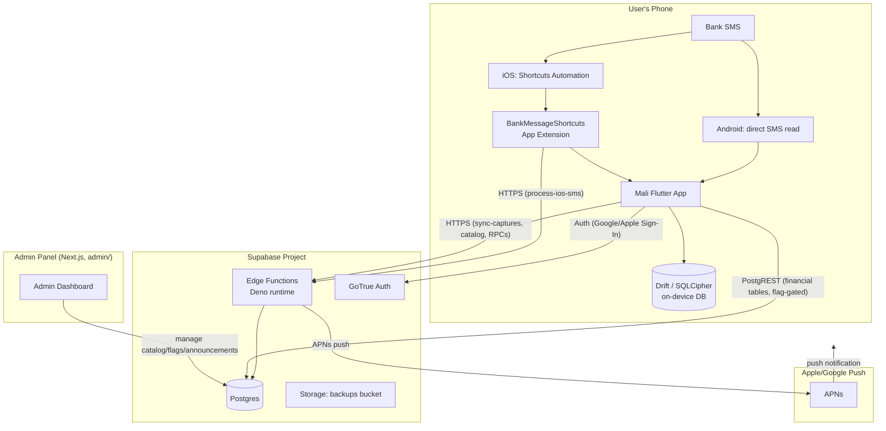
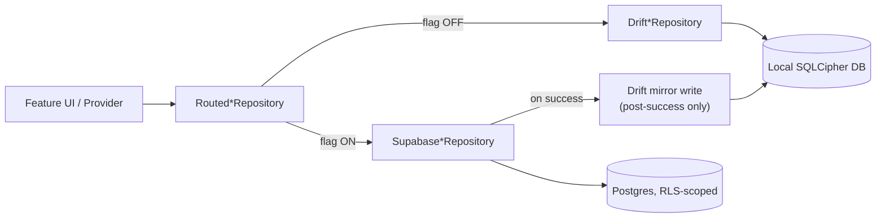
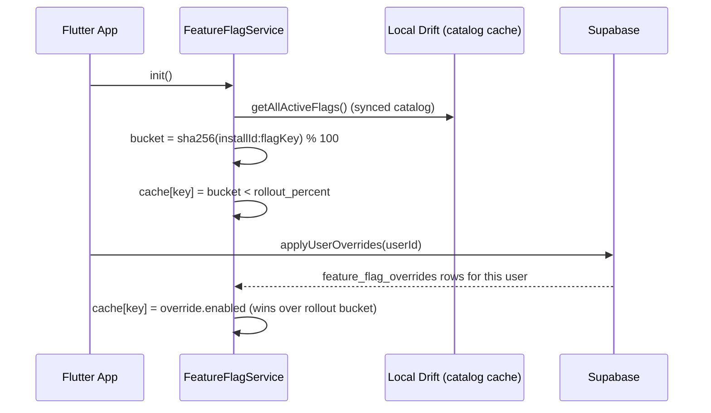

# 03 — Architecture

Related: [02_PROJECT_DISCOVERY.md](02_PROJECT_DISCOVERY.md), [04_DATABASE.md](04_DATABASE.md), [05_BACKEND.md](05_BACKEND.md), [06_FLUTTER.md](06_FLUTTER.md), [09_DATA_FLOW.md](09_DATA_FLOW.md).

## 1. System context diagram



## 2. Layered architecture (Flutter app)

```
lib/
  main.dart          # bootstrap: Sentry → Supabase → AppSession → DB → runApp
  app.dart            # MoneyApp widget, GoRouter, theme, locale
  core/               # cross-cutting: auth, backend config, DI, security, session, theme, utils
  data/               # concrete implementations: Drift repos, Supabase repos, routed repos, catalog sync
  domain/             # pure Dart: entities, repository interfaces, use cases, domain services
  engine/             # SMS parser (isolate), categorization engine
  features/           # UI + feature-scoped services, one folder per feature
  l10n/               # ARB files → generated localization classes
```

This is a **clean-architecture-adjacent** layering:

- `domain/` has zero dependency on Flutter, Drift, or Supabase — it defines interfaces (`AccountRepository`, `TransactionRepository`, etc.) and use cases (`AddTransactionUseCase`, `IngestCapturedMessageUseCase`).
- `data/` implements those interfaces twice: once against Drift (`DriftAccountRepository`), once against Supabase (`SupabaseAccountRepository`), and wraps both in a `Routed*Repository` that picks one per-call based on a feature flag (see §4 below).
- `features/` contains Riverpod providers and widgets; it depends on `domain/` interfaces, never directly on `data/` implementations (the DI layer in `core/di/app_providers.dart` wires the concrete implementation in).

## 3. Layered architecture (Supabase backend)

```
supabase/
  migrations/          # ordered SQL migrations (0001 → NNNN), the schema source of truth
  rollback/            # one rollback script per migration
  functions/
    _shared/           # shared Deno modules: auth, APNs client, ledger writer, fingerprinting
    process-ios-sms/   # iOS Shortcuts capture relay + parse + optional AI + APNs push
    sync-captures/      # drains the processed_captures relay for the Flutter app
    parse-sms/          # AI-assisted parsing endpoint used by the in-app ingest path
    enrich-merchant/     # merchant → category resolution (Google Places-backed)
    bank-discovery/      # detects new bank senders, suggests bank profiles
    register-device/     # registers an iOS capture device, issues a device secret
    register-push-token/ # registers/updates an APNs token for a device
    link-capture-device/ # links a capture device to an authenticated user
    catalog-*/            # bank/parser/category/flag/announcement catalog sync endpoints
    parser-test/          # admin-panel-facing regex validation endpoint
```

Postgres holds two conceptually distinct sets of tables:

1. **Catalog tables** (`banks`, `sms_parsers`, `currencies`, `countries`, `categories`, `catalog_versions`, `feature_flags`, `announcements`) — global, non-user-scoped, read via anon key, written only via the admin panel/service role.
2. **Financial/capture tables** (`user_accounts`, `user_transactions`, `user_budgets`, `user_goals`, ..., `processed_captures`, `capture_devices`, `capture_fingerprints`, `capture_rate_limits`) — per-user (RLS-scoped) or capture-relay tables (deny-all RLS, service-role-only access via Edge Functions).

See [04_DATABASE.md](04_DATABASE.md) for full schemas.

## 4. The Supabase-primary migration model (routed repositories)

This is the single most important architectural pattern in the current codebase. Every financial repository has three implementations:



Key properties:

- The flag is checked **per call**, inside the routed repository, not once at provider-construction time. This means a flag change takes effect on the *next* repository call — see [06_FLUTTER.md](06_FLUTTER.md) §"Riverpod provider caching pitfall" for why the flag service itself must be passed as a getter function, not a captured instance.
- When Supabase-primary is active, **all reads and writes go to Supabase**, including aggregations (totals, category breakdowns) — there is no partial cutover where reads stay local while writes go remote.
- After a successful Supabase write, the result is mirrored into Drift ("rollback cache mirror") so that disabling the flag later doesn't strand the user on an empty local DB. A mirror-write failure does **not** fail the user-visible operation (Supabase already succeeded); it marks a `financial_cache_health` dirty flag for a later repair pass instead.
- When Supabase-primary is **off**, Drift is authoritative, and a dirty cache-health flag is honored: a Drift read is refused (typed `ServerRepoException('financial_cache_dirty')`) rather than serving stale/partial data, until `financial_cache_repair_service.dart` successfully repairs it.

## 5. Feature flags: per-user rollout mechanism



- Global rollout: `feature_flags.rollout_percent` (0–100) + `is_active` (must be true) determine the population-wide bucket.
- Per-user override: `feature_flag_overrides(user_id, key, enabled)` always wins over the rollout bucket for that specific user, regardless of global percentage — this is the *only* sanctioned mechanism for QA-testing a Supabase-primary path before a general rollout.
- **Never** flip `rollout_percent` above 0 or `is_active` to `true` for a Supabase-primary flag without an explicit, session-specific human approval — see [00_SYSTEM_PROMPT.md](00_SYSTEM_PROMPT.md) Rule 1.

## 6. The capture pipeline (high-level)

Full detail in [14_SMS_CAPTURE_PIPELINE.md](14_SMS_CAPTURE_PIPELINE.md) and [13_NOTIFICATION_PIPELINE.md](13_NOTIFICATION_PIPELINE.md). Architecturally:

- **Android**: SMS → direct on-device parse (deterministic rules + optional AI) → `IngestCapturedMessageUseCase` → transaction saved via the routed repository → local notification.
- **iOS**: SMS → Shortcuts Automation → `PostBankStatusIntent` (App Extension, no main app process needed) → optionally calls `process-ios-sms` Edge Function (deterministic + optional AI parse, server-side duplicate fingerprinting, optional direct write to `user_transactions`, APNs push) → durable relay row in `processed_captures` → Flutter app drains the relay via `sync-captures` next time it's foregrounded, importing anything not already imported.
- **Fallback chain on iOS**: backend unreachable/disabled → the App Extension's embedded Swift `PreviewParser` (a rule-based mirror of the Dart deterministic parser, reading the same bundled `parser_rules.json`) produces a best-effort local notification only — it never creates a transaction on its own; the actual transaction is always created by the main app's ingest pipeline when it next opens.

## 7. Cross-cutting concerns

- **Encryption**: the Drift database is encrypted via SQLCipher (`sqlite3mc`); the encryption key lives in Keychain/Keystore via `flutter_secure_storage`. See [07_SECURITY.md](07_SECURITY.md).
- **Error handling**: all Supabase repository calls funnel raw errors through `mapSupabaseError()` into a sealed `RepoException` hierarchy (`NetworkRepoException`, `AuthRepoException`, `ValidationRepoException`, `ForbiddenRepoException`, `DuplicateRepoException`, `NotFoundRepoException`, `ServerRepoException`, `UnknownRepoException`), each with an Arabic user-facing message via `repoExceptionMessage()`.
- **Idempotency**: user-initiated writes use plain `INSERT` + catch Postgres `23505` (unique violation) + fetch-existing — never `UPDATE`, never blind `UPSERT` for user-facing writes. Backfill/system writes may use a controlled `upsert(onConflict:)` against a deterministic key, but only against a **non-partial** unique index (PostgREST cannot infer a conflict target against a partial index — see [04_DATABASE.md](04_DATABASE.md) §"Partial index / upsert incompatibility").
- **Observability**: Sentry for crash/error reporting (`SentryConfig.isConfigured` gates it — the app runs fine without it), structured JSON `console.log`/`console.warn` in Edge Functions (never logging full SMS text or secrets). See [24_MONITORING.md](24_MONITORING.md).

## 8. Why this architecture, not something simpler

- **Why not backend-only from day one?** Regulatory/trust posture in the target market favors "your bank SMS never has to leave your phone unless you opt in" — the local-first model with backend as an *opt-in* enhancement (per-flag, per-user) preserves that trust story while still enabling sync.
- **Why not a single repository with an internal `if (useSupabase)` branch instead of two implementations + a router?** Because the two implementations have meaningfully different concerns (SQL dialect, offline behavior, idempotency mechanism, error taxonomy) — merging them would produce a single class doing two jobs badly. The router pattern keeps each implementation simple (Rule 2, [01_GLOBAL_RULES.md](01_GLOBAL_RULES.md)) at the cost of one extra indirection layer.
- **Why per-user flags instead of a global staged rollout percentage from the start?** Because financial data migrations are exactly the class of change where a single bad edge case (e.g., the partial-index/upsert bug found during Phase 2 QA) must be caught against a handful of real accounts before it can affect anyone at scale.
