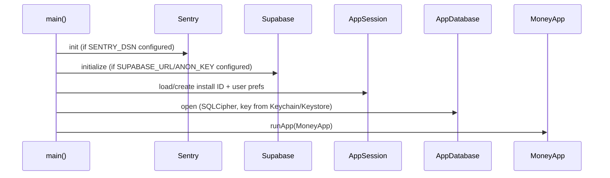

# 06 — Flutter Application

Related: [03_ARCHITECTURE.md](03_ARCHITECTURE.md), [08_FEATURES.md](08_FEATURES.md), [22_CODING_STANDARDS.md](22_CODING_STANDARDS.md).

## 1. Tech stack

| Layer | Library |
|---|---|
| State management | `flutter_riverpod` |
| Navigation | `go_router` |
| Local DB | `drift` (SQLCipher-encrypted via `sqlite3mc`) |
| Secure storage | `flutter_secure_storage` (encryption key, device secret, JWTs) |
| Backend client | `supabase_flutter` |
| Auth providers | Google Sign-In, Sign in with Apple |
| Charts | `fl_chart` |
| Animations | `flutter_animate` |
| Icons | `lucide_icons` |
| Fonts | `google_fonts` |
| Error tracking | `sentry_flutter` |
| Biometrics | `local_auth` |
| Local notifications | `flutter_local_notifications` |
| HTTP | `http` (direct Edge Function calls that don't go through the Supabase client) |

## 2. Bootstrap sequence (`main.dart`)



Every external dependency (`Supabase`, `Sentry`) is optional at the config level: `SupabaseConfig.isConfigured` / `SentryConfig.isConfigured` gate their use so the app runs in a fully offline/stub mode without crashing when `--dart-define` values are absent. This matters for local development and CI where secrets may not be present.

## 3. Riverpod usage patterns

- Global providers live in `core/di/app_providers.dart` — this is the single wiring point where a `Routed*Repository` is constructed from its Drift and Supabase implementations plus a feature-flag getter.
- **Provider caching pitfall** (a real bug found and fixed in this codebase): a plain `Provider<T>` caches the result of its build function after the first `ref.watch()`/`ref.read()`. If that build function captures a **mutable singleton by value** (e.g. a `FeatureFlagService` instance that gets reassigned later by `initFeatureFlagService()`), the cached provider keeps referencing the **old** instance forever, even after the singleton is reassigned. Fix: pass a **getter function** (`FeatureFlagService Function()`) into anything that needs "the current flag service," not a captured instance. This pattern recurs anywhere a provider needs to observe a value that's mutated outside Riverpod's own state graph.
- `ref.invalidate(provider)` is used deliberately after a feature-flag transition (see `AppShell._handleSupabasePrimaryFlagTransition()`) to force every cached `FutureProvider` reading from a routed repository to re-fetch from the (possibly now-different) backing store.

## 4. Navigation

`go_router`-based, wired in `app.dart`. Top-level shell (`AppShell`) hosts a bottom navigation bar with an `IndexedStack` of five pages (Dashboard, Transactions, Budgets, Settings, Reports — Reports is only built when active, since it embeds a `TabBarView` needing bounded height). Deep links from notifications (`/transaction/<id>`, `/smart-inbox`, `/reports`) are resolved through `CaptureRuntime`'s navigation stream, not directly through `go_router`'s own deep-link handling, because routing must also account for capture-sync state (see [13_NOTIFICATION_PIPELINE.md](13_NOTIFICATION_PIPELINE.md)).

## 5. Localization (`l10n/`)

ARB files → generated `app_localizations_*.dart` via `flutter gen-l10n`. **Every** new user-facing string requires both an `ar` and `en` entry — Arabic is the primary/default locale, not a translation-afterthought. Regenerate after any `.arb` change:

```bash
flutter gen-l10n
```

## 6. Key feature-scoped services

| Service | Responsibility |
|---|---|
| `CaptureRuntime` | Singleton event bus (streams) connecting native capture callbacks, notification taps, and quick actions to `AppShell` |
| `CaptureSyncService` | Drains the backend capture relay (`sync-captures`), serialized via an in-flight-future guard so concurrent callers (resume + notification-tap) share one run |
| `NativeCaptureBridge` | `MethodChannel` wrapper over the iOS/Android native capture bridge (drain queue, APNs token, notification routes, re-enqueue-on-failure) |
| `LocalNotificationService` | All local notification scheduling/display, quiet hours, background confirm/dismiss actions |
| `FeatureFlagService` | Resolves global rollout + per-user overrides into an in-memory flag cache |
| `CatalogSyncService` | Delta-syncs banks/parsers/categories/flags/announcements from Supabase into Drift |
| `AddTransactionUseCase` / `IngestCapturedMessageUseCase` | Domain-layer orchestration for turning a parsed SMS into a stored transaction, including duplicate detection and transfer accounting |

## 7. Testing conventions in this codebase

- Unit/widget tests live under `test/`, mirroring `lib/`'s folder structure.
- Drift-backed tests use `NativeDatabase.memory()` with a fake `DatabaseKeyStore` (no real Keychain dependency) — see any `*_test.dart` under `test/data/` or `test/features/capture/` for the pattern.
- Supabase-backed tests use `http/testing.dart`'s `MockClient` to fake PostgREST responses, constructing a real `SupabaseClient` pointed at a fake base URL — never a live network call in a unit test.
- Native-plugin-dependent code (e.g. `path_provider`) is tested by substituting `PathProviderPlatform.instance` with a fake implementing the platform interface, not by mocking the Dart wrapper class directly.

See [10_TEST_STRATEGY.md](10_TEST_STRATEGY.md) for the full test pyramid and [11_TEST_MATRIX.md](11_TEST_MATRIX.md) for concrete scenarios.

## 8. Build & run

```bash
cd app
flutter pub get
flutter gen-l10n
flutter analyze                                   # must be 0 issues
flutter test                                       # must pass

flutter run -d "Mali-iPhone"                       # offline-stub mode
flutter run -d "Mali-iPhone" \
  --dart-define=SUPABASE_URL=https://your-ref.supabase.co \
  --dart-define=SUPABASE_ANON_KEY=your-anon-key      # backend-connected mode
```

Real-device iOS builds require a paid Apple Developer account (App Groups entitlement, needed for the capture-pipeline shared storage between the main app, the Share Extension, and the App Intent extension).

## 9. Codegen

```bash
dart run build_runner build --delete-conflicting-outputs   # after Drift table definition changes
flutter gen-l10n                                            # after .arb changes
```

## 10. iOS native targets

Three Xcode targets share capture-pipeline code via **byte-identical copies** of `SharedCaptureStore.swift` (Swift targets do not share source automatically without a framework — this project keeps three manually-synced copies instead, by explicit choice, documented in-file):

- `Runner` — the main Flutter app.
- `ShareBankMessage` — a Share Extension (manual "share a message to Mali" flow).
- `BankMessageShortcuts` — the App Intent extension (`PostBankStatusIntent`, "Process Bank SMS," used by the Shortcuts automation).

**Any edit to `SharedCaptureStore.swift` must be applied to all three copies identically** — verify with:

```bash
md5 ios/Runner/SharedCaptureStore.swift ios/ShareBankMessage/SharedCaptureStore.swift ios/BankMessageShortcuts/SharedCaptureStore.swift
```

All three hashes must match. This is a standing regression risk called out explicitly in this project's process memory — treat it as a mandatory check after any change to that file, not an optional nicety.
