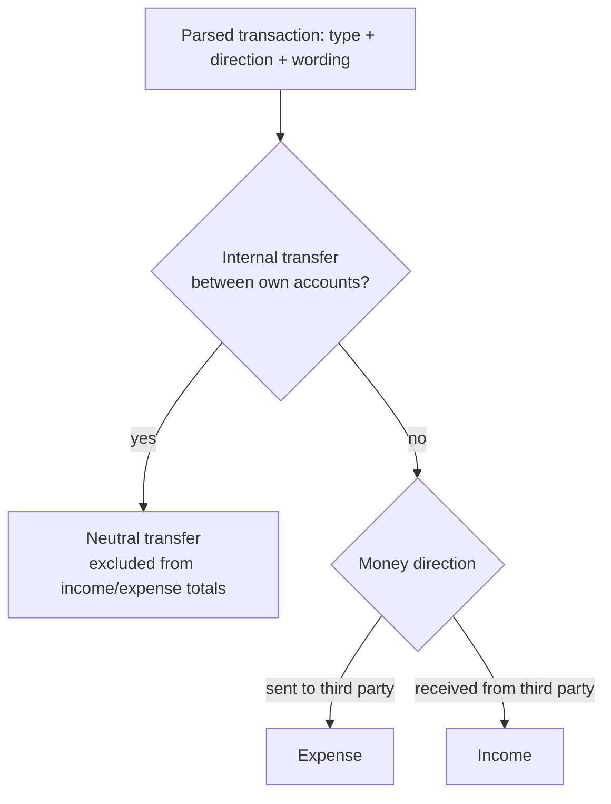
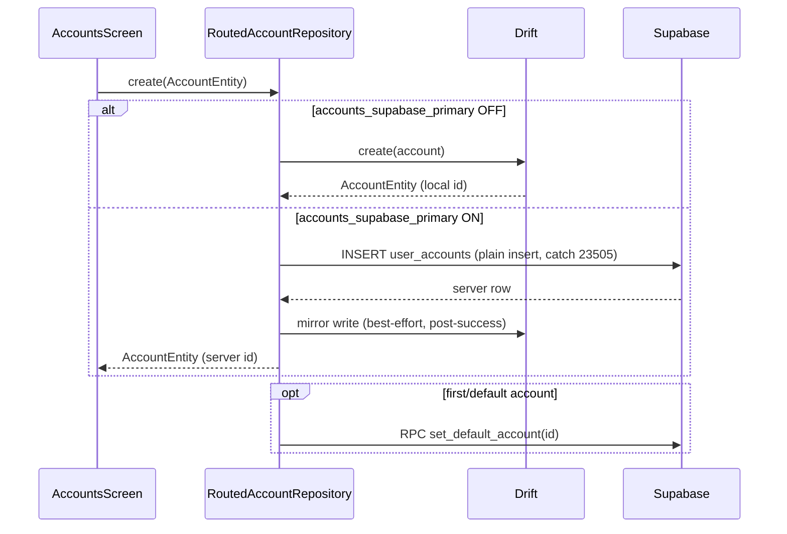
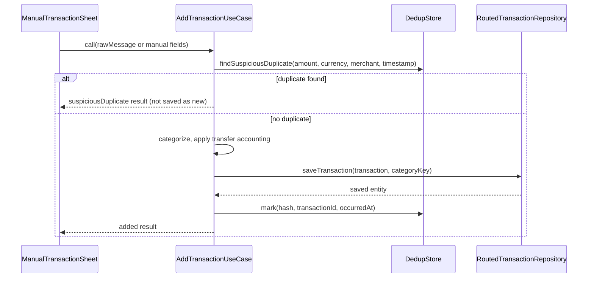
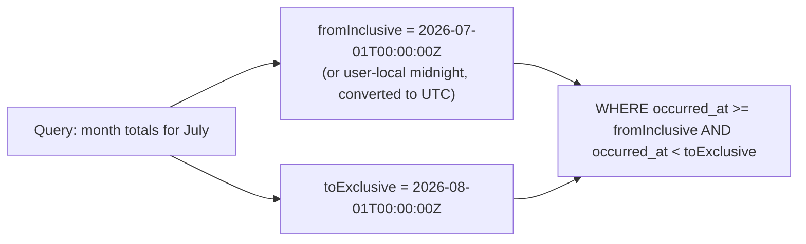
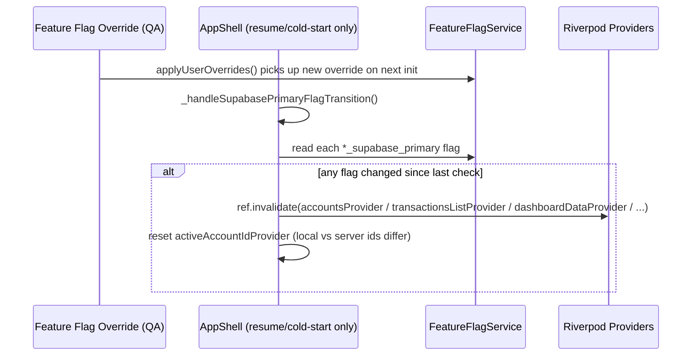
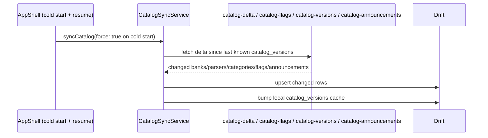

# 09 — Data Flow

Related: [03_ARCHITECTURE.md](03_ARCHITECTURE.md), [13_NOTIFICATION_PIPELINE.md](13_NOTIFICATION_PIPELINE.md), [14_SMS_CAPTURE_PIPELINE.md](14_SMS_CAPTURE_PIPELINE.md).

This document traces how data moves end-to-end for every major flow. For the capture/notification pipeline specifically, see the two dedicated deep-dives — this document gives the shorter version plus every *other* flow.

## 1. Transfer accounting (a rule applied in three places, must never diverge)

This exact logic is implemented independently in three places and **must stay behaviorally identical** across all three:

1. `AddTransactionUseCase` (the primary local ingest path, Android + iOS-relay-imported captures).
2. `CaptureSyncService._importCapture` (the relay-import path specifically, for the transfer-type reclassification when `looksLikeInternalTransfer()` is false).
3. Any future dashboard/report Supabase RPC that recomputes totals server-side (see [30_ROADMAP.md](30_ROADMAP.md)) — when written, it must encode the same three-way branch, not re-derive it from `direction` alone.

**Regression risk**: if only one of the three is updated when the transfer-detection wording list changes, income/expense totals silently diverge between the local-ingest path and the relay-import path for the exact same SMS. See [18_REGRESSION.md](18_REGRESSION.md).

## 2. Account creation flow

If the mirror write fails after a successful Supabase insert, the operation is still reported as **success** to the UI (Supabase is authoritative); `financial_cache_health` is marked dirty for that entity type, and the next successful app resume attempts a repair (`FinancialCacheRepairService`).

## 3. Transaction creation flow (manual entry)

## 4. Transaction deletion flow

Deletion is a **soft delete** server-side (`deleted_at` set, row never physically removed) and a hard delete locally in Drift (row removed, since Drift is either authoritative-and-mirrored-from-server or the sole store). A deleted transaction's dedup hash is **not** removed — re-adding the same SMS after deletion is intentionally allowed again (the dedup join explicitly excludes rows with a terminal "ignored"/deleted status), so the user can correct an accidental delete by re-capturing.

## 5. Transfer / multi-currency dashboard totals

Per-currency totals are computed independently per currency — there is no cross-currency summation. A user with a SAR account and an EGP account sees two separate total lines, never a converted single figure. This is a deliberate non-goal (see [02_PROJECT_DISCOVERY.md](02_PROJECT_DISCOVERY.md) §6), not a missing feature — do not "fix" it by adding silent FX conversion without an explicit product decision.

## 6. Month-rollover / date-boundary flow

A transaction occurring at exactly midnight on the first of the next month must **never** be double-counted into both months, and a transaction in a non-UTC timezone near a day boundary must land in the month the user actually perceives it in. See [11_TEST_MATRIX.md](11_TEST_MATRIX.md) `RPT-0xx` series for concrete boundary test cases (Riyadh/Cairo timezones specifically, since they're the primary user base and do not share a UTC offset).

## 7. Feature-flag transition flow (mid-session)

**Important limitation, by design**: this transition detection runs only at cold-start and on app resume — a flag changed mid-foreground-session (e.g., an admin toggles an override while the user has the app open) is not picked up until the next resume/relaunch. This is documented, expected behavior, not a bug.

## 8. Catalog sync flow

Catalog sync always runs before `FeatureFlagService.init()` so flag resolution reflects the latest known flag definitions.

## 9. Backup/export flow

User-initiated only (never automatic/scheduled): the Drift database is exported (encrypted), uploaded to the user's private `backups` Storage bucket path, and a `backups` metadata row is written. Restore reverses this: download, decrypt, replace the local Drift file, reopen. See [26_BACKUP_STRATEGY.md](26_BACKUP_STRATEGY.md) for the exact procedure and its failure modes.

## 10. Where to look next

- Capture/notification specifics: [13_NOTIFICATION_PIPELINE.md](13_NOTIFICATION_PIPELINE.md), [14_SMS_CAPTURE_PIPELINE.md](14_SMS_CAPTURE_PIPELINE.md).
- Concrete test coverage for every flow above: [11_TEST_MATRIX.md](11_TEST_MATRIX.md).
- SQL playbooks to verify any of the above directly against the database: [12_DATABASE_VALIDATION.md](12_DATABASE_VALIDATION.md).
