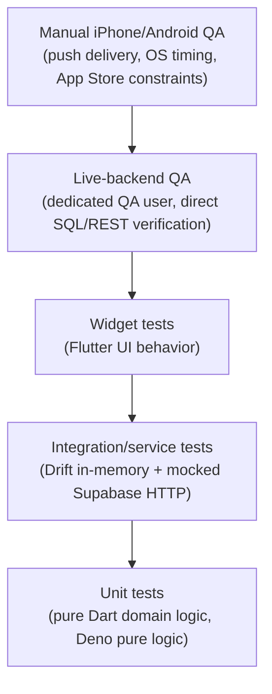

# 10 — Test Strategy

Related: [11_TEST_MATRIX.md](11_TEST_MATRIX.md), [12_DATABASE_VALIDATION.md](12_DATABASE_VALIDATION.md), [18_REGRESSION.md](18_REGRESSION.md).

## 1. Philosophy

Mali has **no separate staging environment** — there is one Supabase project, used for both real users and QA. This shapes the entire test strategy:

- Safety comes from **feature-flag scoping** (per-user overrides) and **dedicated QA identities**, not from environment isolation.
- Every test that touches the live backend must be traceable to a QA-owned row (test payload-ID prefix, test install ID, test user email) so cleanup is unambiguous and safe.
- Automated tests (unit/widget) carry the bulk of regression protection precisely because live-QA cycles are expensive and must be spent on things automated tests structurally cannot cover (real push delivery, real device timing races, App Store review constraints).

## 2. The test pyramid

Read bottom-to-top as "cheapest and fastest to run, broadest coverage" → top as "most expensive, narrowest but irreplaceable coverage."

| Layer | What it catches | What it cannot catch |
|---|---|---|
| Unit (Dart domain logic, Deno pure functions) | Parsing correctness, transfer-accounting logic, fingerprint bucketing math, category resolution | Anything involving real I/O, timing, or OS behavior |
| Integration (in-memory Drift + mocked HTTP) | Repository routing correctness, idempotency-on-retry logic, cache-mirror behavior | Real network races, real Postgres constraint enforcement, real RLS |
| Widget | UI rendering, error-state display, form validation | Backend correctness |
| Live-backend QA | RLS enforcement, RPC atomicity, real Postgres constraint behavior, real Edge Function responses, real idempotency under actual concurrent requests | OS-level push delivery, real device background/foreground transitions |
| Manual device QA | Real APNs delivery, real notification-tap routing, real app-killed/backgrounded behavior, real Shortcuts automation behavior | Nothing structurally — this is the ground truth layer, and therefore the most expensive per test |

## 3. Gate matrix by change type

| Change touches... | Required gates |
|---|---|
| Any Dart file under `app/lib/` | `flutter analyze` (0 issues), `flutter test` (all pass) |
| Any `.arb` localization file | `flutter gen-l10n` regenerated and committed, then the above |
| Any Drift table definition | `dart run build_runner build --delete-conflicting-outputs`, schema version bumped, migration case added, then the above |
| Any iOS native Swift file | `xcodebuild -workspace ios/Runner.xcworkspace -scheme Runner -sdk iphonesimulator build CODE_SIGNING_ALLOWED=NO` **and** the `BankMessageShortcuts` scheme build, plus (if `SharedCaptureStore.swift` touched) the three-copy md5 check |
| Any Edge Function or shared Deno module | `deno check <file>`, `deno test <file>` for any pure-logic module with tests |
| Any Supabase migration | Rollback file exists, applied against live project only after the checks in [12_DATABASE_VALIDATION.md](12_DATABASE_VALIDATION.md), migration history synchronized (`supabase migration list` shows it applied on both local and remote) |
| Any feature-flag-gated repository path | Both the flag-off (Drift) and flag-on (Supabase) code paths exercised, not just one |
| Any notification/capture pipeline file | The specific race/duplicate-prevention regression tests in [18_REGRESSION.md](18_REGRESSION.md) must all still pass |

No phase/PR is "done" while any applicable gate is red. Fix forward within the current change — do not defer a failing gate to a follow-up unless explicitly agreed with the user.

## 4. What "MANUAL QA REQUIRED" means

Some behaviors are structurally impossible to verify from an automated environment without OS-level Accessibility access or a physical device with a real SIM/push-capable Apple ID (this project's sandboxed dev environment specifically lacks GUI automation and blocks the tooling — `idb-companion` — that would otherwise allow it). Any such test scenario in [11_TEST_MATRIX.md](11_TEST_MATRIX.md) is explicitly labeled `MANUAL QA REQUIRED` rather than silently skipped or falsely marked passing. An AI agent must never:

- Fabricate a "PASS" for a manual-only scenario.
- Request OS Accessibility permissions as a workaround.
- Add a debug bypass specifically to make a manual scenario automatable in a way that changes production behavior.

Instead: hand the exact step-by-step procedure to a human tester (see [13_NOTIFICATION_PIPELINE.md](13_NOTIFICATION_PIPELINE.md) §"Manual QA flow" for the canonical format), and verify everything *around* it (backend state, logs, database rows) that *is* automatable.

## 5. Test data conventions

- QA payload IDs: prefix `smoke_test_` or `qa_test_` — never a bare UUID indistinguishable from real traffic.
- QA install IDs: prefix `qa-` followed by a description and date, e.g. `qa-hardening-smoke-2026-07-13`.
- QA users: a small, fixed set of dedicated Supabase Auth accounts, never a real user's account, never created and abandoned without cleanup.
- Cleanup after any live QA session: delete only rows matching the QA identifiers above; verify row counts for real data are unchanged before and after (see [12_DATABASE_VALIDATION.md](12_DATABASE_VALIDATION.md) §"Safety verification queries").

## 6. Coverage expectations

- New domain logic (use cases, parsers, categorizers): unit tests covering the happy path, at least one edge case, and any explicitly-called-out ambiguous case from the requirements.
- New repository methods: at minimum, a test proving idempotency-on-retry (23505 recovery) if the method writes data, and a test proving the routed repository picks the correct backing store per flag state.
- New Edge Function logic: `deno test` coverage for anything with nontrivial branching (duplicate detection, timestamp bucketing, rate limiting) — do not rely solely on live-QA verification for logic that can be unit-tested.
- Bug fixes: a regression test reproducing the original bug is required before the fix is considered complete (see [17_BUG_WORKFLOW.md](17_BUG_WORKFLOW.md)).

## 7. Where this strategy has already caught real bugs

Documented precedent (see [18_REGRESSION.md](18_REGRESSION.md) for the full list with test IDs):

- A partial-unique-index/PostgREST-upsert incompatibility (`42P10`) — found via live-backend QA, not unit tests (the bug only manifests against a real Postgres instance's conflict-target inference).
- A missing per-user feature-flag-override read path — found via live-backend QA comparing expected vs actual routing.
- A Riverpod provider-caching staleness bug — found via live device QA (flag changes not reflected until relaunch, traced to a captured-instance-vs-getter-function bug).
- A category key/local-id mismatch causing "Uncategorized" display — found via live device QA, then covered by a permanent unit test afterward.
- A dedup-marker pruning bug (epoch-0 timestamped markers deleted by age-based pruning) — found via **code audit**, not QA, then fixed with a targeted regression test before any live reproduction was needed (see [17_BUG_WORKFLOW.md](17_BUG_WORKFLOW.md) for why an audit-first approach was preferable here: reproducing it live would have required an actual failed-ack race condition, expensive to force deliberately).

This history is why the pyramid in §2 treats live QA as necessary-but-expensive: several of the most consequential bugs were only reachable there, but several others were cheaper to find and fix via careful code reading plus targeted unit tests. Prefer the cheaper method whenever it can plausibly reach the bug class.
