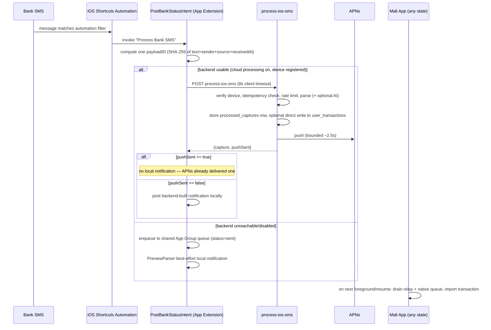
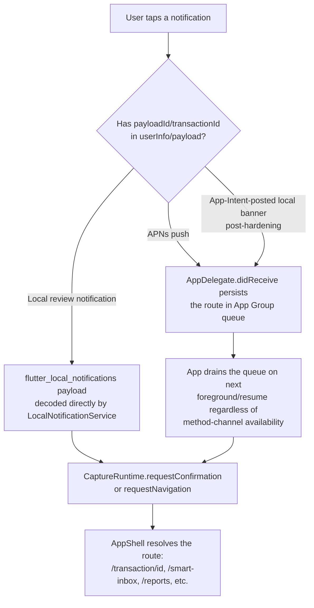

# 13 — Notification Pipeline

Related: [14_SMS_CAPTURE_PIPELINE.md](14_SMS_CAPTURE_PIPELINE.md), [11_TEST_MATRIX.md](11_TEST_MATRIX.md), [18_REGRESSION.md](18_REGRESSION.md).

This document covers **every notification a user can receive** and the exact rules governing when it fires, how it's deduplicated, and how a tap routes. Capture-triggered notifications are the most complex category and are detailed here end-to-end; other notification types (budget, achievement, goal milestone, streak, weekly report, bill reminder, marketing) are simpler and covered in §5.

## 1. Full capture-notification path (end to end)

## 2. The three parsers, and which is "real"

| Parser | Runs where | Can create a transaction? | Role |
|---|---|---|---|
| Deterministic rule parser (Dart) | On-device, Dart isolate, 2s timeout | Yes — the primary local ingest path (Android, and iOS relay-imported captures) | Primary |
| Deterministic rule parser (Deno) | `process-ios-sms` Edge Function | No directly — informs the relay row and optional direct-write | Primary (server mirror of the Dart rules, same `parser_rules.json`) |
| AI parser (Gemini) | Edge Function, only if `allowAi` | No directly — merged with the deterministic result before the relay row is built | Enhancement, opt-in, never authoritative alone (amount/currency from AI alone without deterministic backup are not trusted) |
| `PreviewParser` (Swift) | iOS App Extension, on-device | **Never** — notification text only | **Fallback only.** Confirmed invariant — see [18_REGRESSION.md](18_REGRESSION.md) and the audit that established this. Any change that makes `PreviewParser` create a transaction directly is an architecture violation requiring explicit sign-off. |

**Backend is always preferred** whenever `canUseBackend` is true (cloud processing enabled + device registered + secret present). `PreviewParser` and the generic fallback notification are only reached when the backend call fails, times out (after one idempotent retry — see §3), or the backend is disabled/unreachable.

## 3. Timeout and race handling (post-hardening)

Prior to the notification/capture pipeline hardening pass, an unbounded Gemini or APNs call inside `process-ios-sms` could push the whole request past the App Intent's 8-second client timeout. The intent would then post a local fallback notification while the server-side request *still completed* and sent its own APNs push — producing two notifications for one capture. Fixed as follows:

- **Server-side bounded timeouts**: the Gemini fetch is bounded to ~3.5s, the APNs fetch to ~2.5s (`AbortSignal.timeout(...)`), keeping the total request comfortably inside the 8s client budget in the overwhelming majority of cases.
- **Client-side one-shot idempotent retry**: if the App Intent's call fails with a timeout-shaped error (`URLError.timedOut` / `.networkConnectionLost`), it retries the *same* `process-ios-sms` call once (same `payloadId`) before falling back locally. Because the endpoint is idempotent per `payloadId` (see [14_SMS_CAPTURE_PIPELINE.md](14_SMS_CAPTURE_PIPELINE.md) §3), the retry either returns the already-committed result (and the intent correctly shows nothing further if `pushSent` is now true) or genuinely fails again (falls back locally, correctly, since the backend really is unreachable).
- **`pushSent` replay correction**: a replay of an already-stored payload now re-attempts APNs if it was never confirmed sent (`apns_push_sent_at IS NULL`), rather than trusting a possibly-stale `false` read between the original send and its database write landing. Because APNs pushes use a stable `apns-collapse-id` per `payloadId`, a re-send **replaces** the earlier banner on the device rather than duplicating it.
- **Deterministic local-notification identifiers**: every notification the App Intent schedules locally uses an identifier derived from `payloadId` (e.g. `capture_backend_<payloadId>`, `capture_fallback_<payloadId>`) instead of a random UUID, so a retried/duplicated schedule call replaces rather than stacks.

## 4. Duplicate-notification prevention rules (complete list)

1. **Status gate**: any capture the App Intent already enqueued with `status: .sent` (meaning it already showed a notification itself) is never re-notified by the main app's own drain logic.
2. **`pushSent` gate**: the App Intent only shows its own local notification when the server reports `pushSent == false` — if APNs already delivered, nothing else is shown.
3. **Deterministic identifiers** (§3): retries/replays replace rather than duplicate a given payload's banner.
4. **Enqueue-outcome gate**: the App Intent only shows a fallback notification when the payload was actually durably queued (`.enqueued`), never on `.duplicate` (already queued and already notified by an earlier run) or `.failed` (App Group write failed — nothing durable exists to promise the user).
5. **`apns-collapse-id`**: stable per `payloadId` (`qirsh-capture-<payloadId>`), so even a genuine second APNs send for the same payload collapses into one visible banner on the device.

## 5. Non-capture notification types

| Type | Trigger | Dedup mechanism |
|---|---|---|
| Budget alert (75/90/100%+) | Spend crosses a threshold | Notification ID encodes year+month+threshold bucket — naturally idempotent per bucket per month |
| Achievement/badge | Passive badge evaluation on resume/capture | Badge-unlock state itself is the dedup guard (a badge can't unlock twice) |
| Goal milestone | Contribution crosses a milestone percentage | ID encodes goal + milestone bucket |
| Streak reminder | Evening, if no activity today | Rescheduled/canceled per day based on `hasActivityToday`, single fixed ID |
| Weekly report | Scheduled | Single fixed ID, rescheduled each planning pass |
| Bill/subscription reminder | Scheduled ahead of due date | ID range reserved per bill, canceled/rescheduled per planning pass |
| Marketing/growth | `NotificationJourneyService` evaluation | Distinct ID scheme, tracked separately from capture history |

All of the above respect user-configured quiet hours (`quietHoursEnabled`, start/end hour) **except** capture notifications, which are treated as time-sensitive and shown immediately regardless of quiet hours — this is intentional (a delayed transaction notification is much less useful hours later).

## 6. Notification tap routing

Prior to hardening, App-Intent-posted local fallback banners carried no `userInfo`, so tapping one just opened the app with no route resolution (fell through to the `super` handler). This is fixed: all locally-scheduled notifications now carry `payloadId`, `source`, and `notificationType` in their `userInfo`, exactly mirroring the APNs payload shape, so `AppDelegate.didReceive` recognizes and routes them identically.

## 7. Manual QA flow (device-only scenarios)

These require a real iPhone with the app installed (via `flutter run` or a signed build), a real Apple ID capable of receiving push notifications, and a configured Shortcuts automation. They cannot be automated from this development environment (no Accessibility/GUI automation access) — mark any attempt otherwise as invalid. Use a **dedicated QA user and per-user flag overrides only**; never touch real user data; keep all global flags OFF throughout.

For each step: perform the exact action, then compare against the exact expected notification, Supabase row, Drift/cache state, and logs before marking PASS/FAIL.

### Step 1 — Normal backend parse + APNs success
Action: send yourself a realistic bank SMS matching an automation filter, with cloud processing enabled and a registered/linked QA device.
Expected notification: exactly one APNs banner, title matching the parsed transaction type (e.g. "تم رصد عملية شراء 🛒"), body with amount/merchant/time/category.
Expected Supabase: one `processed_captures` row (`status = processed`), `apns_push_sent_at` non-null; if direct-write flags are on for the QA user, one `user_transactions` row with matching `source_payload_id`.
Expected Drift/cache: after next app open, exactly one transaction row, confirmed, correct account/category.
Expected logs: `capture_stored`, `apns_sent` in Edge Function logs; no error-level Flutter logs.
PASS: exactly one banner, one transaction, no duplicate.

### Step 2 — APNs failure → local backend-parsed fallback
Action: same as Step 1 but with a QA device that has no valid/registered APNs token (or airplane-mode the push channel specifically if feasible).
Expected notification: exactly one **local** notification, built from the backend's parsed result (not `PreviewParser`), since the backend call itself succeeded.
Expected Supabase: `processed_captures` row exists, `apns_push_sent_at` null, `apns_push_error` populated.
Expected logs: `apns_skipped` or `capture_apns_failed` in Edge Function logs.
PASS: exactly one notification, no second one after the app is later opened.

### Step 3 — Backend timeout → one fallback only
Action: send an SMS while forcing a slow backend response if feasible (e.g., toggle AI on with a deliberately slow network), or accept this as best-effort given real timing is hard to force exactly.
Expected: exactly one notification total — either the backend's (if it actually completed) or the local fallback (if it genuinely didn't), never both.
Expected logs: if a retry occurred, a second `process-ios-sms` call for the same `payloadId` returning `idempotent: true`.
PASS: never two banners for one SMS.

### Step 4 — Tap local fallback → correct routing
Action: trigger Step 2's or Step 3's local fallback notification, then tap it.
Expected: app opens and routes to the correct transaction (or Smart Inbox if still pending), not just a blank dashboard.
PASS: navigation lands on the transaction detail screen or Smart Inbox, matching the captured SMS.

### Step 5 — Background confirm action → server row confirmed
Preconditions: QA user has `transactions_supabase_primary` override ON.
Action: receive a `needs_review` capture notification, tap "تأكيد ✓" directly from the notification while the app is backgrounded/closed (do not open the app first).
Expected Supabase: after next app open, the corresponding `user_transactions` row shows confirmed status — not left pending.
Expected Drift: local mirror also reflects confirmed.
PASS: server row is authoritative-confirmed, not silently reverted on next load.

### Step 6 — Duplicate same payload → one transaction
Action: re-run the exact same Shortcut invocation for the same SMS text (e.g., re-trigger the automation manually on the same message) so the same `payloadId` is generated.
Expected: idempotent — exactly one transaction, exactly one (collapsed) notification presence, no duplicate row.
PASS: single transaction in the list.

### Step 7 — Same SMS run twice without "Date Received" set → pending/suspicious duplicate
Preconditions: a Shortcut automation deliberately **not** passing the Date Received field (or passing a slightly different one each run).
Action: run the automation twice on the same SMS body.
Expected: the second run is flagged suspicious-duplicate (bucketed fingerprint tolerance), landing in Smart Inbox for review — **never** silently imported as a second confirmed transaction.
PASS: exactly one confirmed transaction; the second appears as a reviewable duplicate, not a silent double-count.

### Step 8 — App foreground notification behavior
Action: with the app open and in the foreground, trigger a capture.
Expected: the transaction appears in the list live (no manual refresh needed); observe whether an in-app banner also appears (this is an open/unverified behavior dependent on OS-level `willPresent` handling — record what actually happens as the baseline, not an assumed pass/fail).
PASS: no duplicate transaction; UI updates live.

### Step 9 — App killed, then capture, then reopen
Action: force-quit the app entirely, then trigger a capture via the Shortcut, then reopen the app from the home screen (not via the notification).
Expected: on reopen, the transaction has been imported exactly once via the normal drain-on-launch path.
PASS: single transaction present after reopen.

### Step 10 — Failed ack followed by prune → no re-import
This scenario is primarily verified via the automated regression test (`capture_sync_service_test.dart`, "failed ack followed by dedup prune must not re-import the capture") rather than live device manipulation, since forcing a real ack failure on a device is impractical to do deliberately and safely. Manual confirmation (optional, best-effort): observe app behavior after a genuine transient network blip during the ack round-trip; the capture must not reappear as a second transaction on the next sync.
PASS: automated regression test passing is the primary bar; device observation is supplementary.

### Step 11 — Concurrent resume + notification tap → one import
Action: trigger a capture, then as the push notification arrives, background/foreground the app rapidly while also tapping the notification, to try to force the resume-drain and the notification-tap-drain to overlap.
Expected: exactly one transaction imported, regardless of the exact interleaving (protected by `CaptureSyncService`'s in-flight-sync guard).
PASS: no duplicate, verified by row count in Supabase/Drift after settling.

### Step 12 — Rejected SMS copy is honest
Action: send a non-transaction SMS (e.g., an OTP or a marketing message from a registered bank sender) through the pipeline.
Expected notification: wording instructing the user to paste the message manually ("الصقها يدوياً في قرش لإضافتها") — must **not** claim an in-app review exists, since a rejected capture creates no Smart Inbox item.
PASS: copy matches the honest wording; tapping it does not lead to an empty/confusing review screen.

### Step 13 — Cron retention job runs and logs counts only
This is a backend-only verification, not a device scenario — see [12_DATABASE_VALIDATION.md](12_DATABASE_VALIDATION.md) §5. Confirm `cron.job` shows the job active and scheduled daily, and that a manual invocation of `run_prune_processed_captures()` logs only row counts (`RAISE LOG 'prune_processed_captures: captures=% fingerprints=%', ...`), never row contents.
PASS: job present, active, correctly scheduled; log line contains counts only.

## 8. What to do if a manual step fails

Do not silently retry until it passes. Capture the exact observed notification/state, compare against the expected state above, and file it per [17_BUG_WORKFLOW.md](17_BUG_WORKFLOW.md) with the specific step ID (e.g. "Step 3 failed: two banners observed") as the reproduction anchor.
