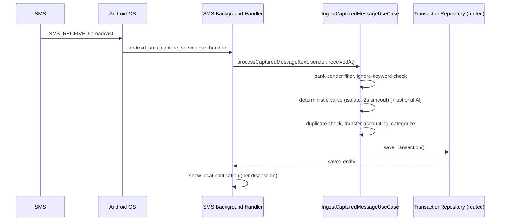
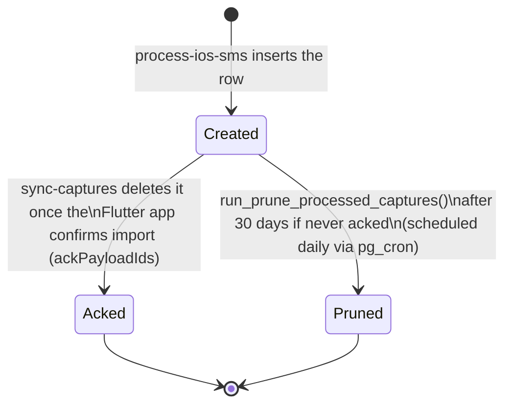

# 14 — SMS Capture Pipeline

Related: [13_NOTIFICATION_PIPELINE.md](13_NOTIFICATION_PIPELINE.md), [09_DATA_FLOW.md](09_DATA_FLOW.md), [11_TEST_MATRIX.md](11_TEST_MATRIX.md).

This document covers how a bank SMS becomes a transaction — parsing, duplicate detection, platform-specific capture mechanics, and the capture-relay data lifecycle. For notification delivery/dedup mechanics specifically, see [13_NOTIFICATION_PIPELINE.md](13_NOTIFICATION_PIPELINE.md).

## 1. Android capture path (direct, no relay needed)

Android has direct `READ_SMS`/`RECEIVE_SMS` permission access (see [11_TEST_MATRIX.md](11_TEST_MATRIX.md) `ONB-002`/`ONB-003`) — there is no relay, no App Extension, no backend round-trip required for the base case. The **same** `IngestCapturedMessageUseCase` is used here as for iOS relay-imported captures, which is why transfer-accounting and duplicate-detection logic must never diverge between platforms (see [09_DATA_FLOW.md](09_DATA_FLOW.md) §1).

**Do not change Android SMS permission handling without a separate, explicit review** — this is a sensitive Play Store policy area (SMS/Call Log permissions are restricted to a narrow set of approved use cases) and changes here can affect app store approval, not just functionality.

## 2. iOS capture path (Shortcuts + relay)

Full sequence in [13_NOTIFICATION_PIPELINE.md](13_NOTIFICATION_PIPELINE.md) §1. Summary of the pieces:

- **`BankMessageShortcuts` App Extension** (`PostBankStatusIntent`): runs independently of the main app process, invoked by a user-configured Shortcuts Automation. Computes one `payloadID`, optionally calls the backend, always ensures the capture is durably represented somewhere (backend relay row, or the shared App Group queue as a last resort).
- **`process-ios-sms` Edge Function**: the server-side parse + relay-store + optional direct-write + APNs push.
- **`processed_captures`**: the durable relay row. **This table is a deliberate, temporary safety-net mechanism, not legacy cruft** — do not remove it or the App Extension's use of it without a separate, explicit approval, even once the direct-write path (`capture_direct_supabase_write`) is fully validated, because it remains the recovery path when direct-write itself fails partway (see §5).
- **`sync-captures` Edge Function**: drains the relay for the main app.
- **`CaptureSyncService`**: the Flutter-side consumer, serialized via an in-flight-future guard (fixed regression — see [18_REGRESSION.md](18_REGRESSION.md) `REG-006`) so a resume-triggered sync and a notification-tap-triggered sync never race each other into a double import.

## 3. Idempotency: the payloadId contract

One `payloadID` is computed **once**, in the App Intent, from `SHA256(text|sender|senderName|senderID|source|receivedAt)`, and used consistently as:

- The key for the backend's `processed_captures` idempotency check (`payload_id` scoped per `install_id_hash` since migration `0033`).
- The key for the App Group queue's own duplicate check (`SharedCaptureStore.enqueue` returns `.duplicate` rather than double-queuing).
- The correlation key for the direct-write path's `user_transactions.source_payload_id` uniqueness (`(user_id, source_payload_id)`).
- The Flutter-side dedup marker key (`capture_payload:<payloadId>` in `dedup_hashes`).

**A single computed ID feeding four independent dedup layers is the core design decision that makes the whole pipeline idempotent under retries.** Any change that computes the ID differently in two of these places (e.g., a second, independently-computed hash) reintroduces exactly the double-import bug class this design prevents.

### 3.1 Why "Date Received" matters

`payloadID` includes `receivedAt`. If a Shortcuts automation does not pass the message's actual received date (falling back to the intent-run time instead), re-running the same automation on the same SMS produces a **different** `payloadID` each time — bypassing every payloadId-keyed dedup layer above. The server-side fingerprint (§4) is the only remaining defense in that case, and it only fully covers this via its bucketed tolerance window. **The in-app Shortcuts setup guide explicitly instructs setting Date Received to the message's received date** for exactly this reason — treat any removal of that instruction as a regression.

## 4. Server-side duplicate fingerprinting

Independent of `payloadID`, `process-ios-sms` computes a content fingerprint: `amount + currency + normalized-merchant + card-last-4 + time-key`, stored in `capture_fingerprints`.

- **`sms_body`-sourced timestamps** (the bank's own timestamp was successfully extracted from the message text): fingerprint time-key is the **exact** timestamp — two genuinely distinct purchases with the same amount/merchant minutes apart must not collide, and the bank's own timestamp is trusted to disambiguate them.
- **`received_at`-sourced timestamps** (no timestamp in the SMS body, falling back to when the device received it): fingerprint time-key is **bucketed** to 10-minute windows, matching both the current and previous bucket (≈10–20 minute effective tolerance). This exists specifically because a re-run of the same Shortcut without Date Received set (§3.1) produces slightly different receive times each time, and an exact-match fingerprint would miss the duplicate entirely.
- A capture's own fingerprint insert never matches itself as a "duplicate" (self-match is explicitly excluded), which keeps a legitimate idempotent replay of the same `payloadId` from being mislabeled as a duplicate-of-itself.

## 5. Direct-write vs relay-only modes

| Mode | Flag state | Behavior |
|---|---|---|
| Relay-only (default) | `capture_direct_supabase_write` OFF | `process-ios-sms` only ever writes `processed_captures`; the Flutter app imports from the relay via `sync-captures` into whichever repository (Drift or Supabase) is currently authoritative per the transactions flag |
| Direct-write | `capture_direct_supabase_write` ON **and** `transactions_supabase_primary` ON for that user | `process-ios-sms` additionally writes directly to `user_transactions` server-side (via `_shared/ledger.ts`'s idempotent insert-then-recover-on-23505), and records the resulting `serverTransactionId` back onto the relay row |

Even in direct-write mode, **the relay row is still always written first** — direct-write is additive, not a replacement for the relay. This is why `processed_captures` cannot be removed even after direct-write is fully validated: it remains the fallback the Flutter app reads if the direct write itself failed non-fatally (logged as `capture_ledger_write_failed`, swallowed so the relay path still succeeds for the user).

When the app opens after a direct-written capture, `SupabaseTransactionRepository.getBySourcePayloadId()` is checked **before** importing from the relay a second time — this is what prevents a direct-written transaction from also being relay-imported as a duplicate.

## 6. Data lifecycle of `processed_captures`

A row that is never acked (app never reopened, or the device was abandoned/uninstalled) is not immortal — the scheduled retention job (migration `0033`) guarantees it is eventually pruned, bounding storage of transiently-retained `sanitized_text` for `needs_review`/`rejected` captures to 30 days. `capture_fingerprints` rows are pruned after 7 days on the same schedule.

## 7. Full duplicate-prevention layer inventory (capture-specific)

This is the capture-side complement to [13_NOTIFICATION_PIPELINE.md](13_NOTIFICATION_PIPELINE.md) §4 (which covers notification-level dedup). Transaction-level duplicate prevention layers, in the order they're actually checked:

1. **`SharedCaptureStore.enqueue` payload check** (native, App Group queue) — prevents the same payload from being queued twice locally before the app even sees it.
2. **`processed_captures` primary key** (`install_id_hash, payload_id`, migration `0033`) — server-side idempotency; a replay of the same request returns the stored result rather than inserting a second relay row.
3. **`capture_fingerprints`** (§4 above) — content-based duplicate detection independent of `payloadId`, catching the "different payloadId, same real-world transaction" case (missing Date Received, or two genuinely different capture paths for the same SMS).
4. **`dedup_hashes` `capture_payload:` markers** (Flutter-side) — "already imported" registry consulted before importing a relay row; **must be excluded from age-based pruning** (fixed regression, [18_REGRESSION.md](18_REGRESSION.md) `REG-005`) since these markers are intentionally stored with a fixed epoch-0 timestamp as a namespace signal, not a real event time.
5. **`user_transactions (user_id, source_payload_id)`** unique index — server-side idempotency for the direct-write path specifically.
6. **`DuplicateTransactionDetector`** (exact amount/currency/merchant/card/comparison-timestamp match) — the *local ingest* duplicate check (`AddTransactionUseCase`/`CaptureSyncService`), independent of payloadId or server fingerprinting entirely, catching a duplicate even if it arrived through a completely different capture path (e.g., manually pasted after already being auto-captured).

No single layer is sufficient on its own — they exist because each closes a gap the others don't cover (payloadId-based layers fail when Date Received is missing; content-fingerprint layers fail across sufficiently different wording/timing; the local exact-match detector is the last-resort backstop regardless of how the message arrived).

## 8. Reconciliation and backfill considerations

When migrating a financial entity to Supabase-primary for a user with existing local-only data (see [30_ROADMAP.md](30_ROADMAP.md) for the phase plan), backfill uses a deliberately different idempotency mechanism than normal user writes:

- **Normal user-initiated writes**: plain `INSERT` + catch `23505` + fetch-existing-never-update (see [01_GLOBAL_RULES.md](01_GLOBAL_RULES.md) Rule 8-adjacent guidance in [03_ARCHITECTURE.md](03_ARCHITECTURE.md) §7).
- **Backfill writes**: a controlled `upsert(onConflict:)` against a **deterministic** key — `local_id` preserved exactly for accounts, `backfill_transaction_<local_id>` for transactions — so a backfill run can be safely re-executed (resumable/idempotent) without creating duplicates, and so it is unambiguously distinguishable from a normal user write if something needs to be identified and reconciled later.
- Any account/transaction whose relationship cannot be confidently resolved during backfill (e.g., an orphaned `account_id` reference) must be **skipped and reported**, never guessed — see [30_ROADMAP.md](30_ROADMAP.md) Phase 6 for the full reconciliation-report requirements.

## 9. Common failure modes and their signatures

| Symptom | Likely cause | Where to look |
|---|---|---|
| Two notifications for one SMS | Client-timeout race (fixed, but verify bounded timeouts are still in place after any Edge Function change) | [13_NOTIFICATION_PIPELINE.md](13_NOTIFICATION_PIPELINE.md) §3 |
| Transaction imported twice | Missing Date Received + fingerprint tolerance regressed, or `dedup_hashes` pruning regressed | §3.1, §7 layers 3 and 4 |
| Transaction shows "غير مصنّف" (Uncategorized) | Category key/local-id translation missing on a new Supabase read path | [04_DATABASE.md](04_DATABASE.md) §4.1 |
| Capture never appears after reopening the app | Relay row never acked and sync failing silently, or native queue drain lost the message on an unrelated error | Check `sync-captures` logs and `_consumeSharedInput`'s per-message try/catch + re-enqueue path |
| Duplicate flagged as confirmed instead of pending review | Orphan-duplicate-imports-as-confirmed regression (fixed — [18_REGRESSION.md](18_REGRESSION.md) `REG-011`) | `CaptureSyncService._importCapture` status mapping |
| Rate limit triggers earlier than expected under load | Non-atomic rate-limit increment (fixed via `bump_capture_rate_limit` RPC — confirm it's actually being used, not silently falling back) | `_shared/ledger.ts` / `process-ios-sms` rate-limit call |
