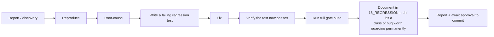

# 17 — Bug Workflow

Related: [10_TEST_STRATEGY.md](10_TEST_STRATEGY.md), [18_REGRESSION.md](18_REGRESSION.md), [00_SYSTEM_PROMPT.md](00_SYSTEM_PROMPT.md).

## 1. The lifecycle



A bug is not "fixed" at step E — it is fixed at step F, and not *done* until G and (where applicable) H.

## 2. How bugs are discovered in this project (three real patterns)

### 2.1 Live-device/live-backend QA
The most expensive but sometimes the only way to catch a bug (real Postgres constraint inference, real OS notification timing, real Riverpod provider lifecycle under a real app restart). When a live QA session surfaces unexpected behavior:

- Capture the **exact** observed state (screenshot, exact error string, exact HTTP status/body) before doing anything else — don't fix from memory of "it seemed off."
- Cross-check against the database directly (see [12_DATABASE_VALIDATION.md](12_DATABASE_VALIDATION.md)) to distinguish a UI-display bug from an actual data-correctness bug — these require very different fixes.
- Only then form a root-cause hypothesis.

### 2.2 Code audit (reading, not running)
Some of the highest-value bugs in this project's history were found by careful reading of the notification/capture pipeline code end-to-end, without ever reproducing them live first — e.g., the epoch-0 dedup-marker pruning bug (`REG-005`) was identified by tracing exactly what `pruneOldDedupHashes()` deletes against exactly how capture-import markers are stored, and recognizing the mismatch, before any live failure was observed. **This is a legitimate and often cheaper discovery path than forcing a live reproduction** — prefer it when a careful trace can plausibly reach the bug class, and be honest in the report about which discovery method was used (see [00_SYSTEM_PROMPT.md](00_SYSTEM_PROMPT.md) §5).

### 2.3 User-reported symptom (often in Arabic, informal)
Real examples from this project's history: a user reporting "ale ta3zar el atsal b khadem taked mn atsal b network" (a network-error toast observed during testing) or "by2oli hadas khata f khadem hawel lahekan" ("server error, try again later" during an edit-amount test). These reports are informal and approximate — the first job is to translate the symptom into an exact reproduction, not to guess at a fix from the paraphrase alone.

## 3. Reproduction discipline

- Reproduce with the **minimum** set of conditions that trigger it — if a bug needs "flag X on, then edit an amount, then background the app," verify each condition is actually necessary before writing the regression test, otherwise the test may pass for the wrong reason.
- For a live-only symptom that can't be reliably forced (e.g., a specific network-timing race), it is acceptable to write the regression test against the *mechanism* believed responsible (e.g., a mocked-timeout unit test) rather than the literal live symptom, but say so explicitly in the fix's documentation — don't claim the regression test reproduces the exact live incident if it actually tests the underlying mechanism in isolation.
- If a bug's root cause cannot be conclusively determined (e.g., a debug diagnostic was added but the process died before the second attempt could confirm it), say so honestly rather than guessing at a fix. Leaving a scoped, temporary diagnostic in place with a clear removal plan is preferable to a speculative fix for an unconfirmed cause.

## 4. Root-causing checklist

- Read the actual code path involved end-to-end before hypothesizing — do not assume behavior from a function's name or a comment.
- For a Supabase-side bug, check the actual live schema/constraints (see [12_DATABASE_VALIDATION.md](12_DATABASE_VALIDATION.md)) rather than only the migration file, since out-of-band SQL changes can desync the two (see [04_DATABASE.md](04_DATABASE.md) §5).
- For a Flutter-side stale-state bug, check whether a Riverpod provider is caching something that should instead be re-read live (see [06_FLUTTER.md](06_FLUTTER.md) §3, "provider caching pitfall").
- For a notification/capture-pipeline bug, check against the complete duplicate-prevention layer inventory in [14_SMS_CAPTURE_PIPELINE.md](14_SMS_CAPTURE_PIPELINE.md) §7 — most new bugs here are a gap in one specific layer, not a wholesale design failure.

## 5. Writing the regression test

Every fix ships with a test that:

1. Fails against the pre-fix code (verify this — don't just trust that it would fail).
2. Passes against the post-fix code.
3. Is placed in the test file matching the changed production file's location (mirrored folder structure — see [06_FLUTTER.md](06_FLUTTER.md) §7).
4. Has a clear, specific test name describing the exact scenario, not a generic "bug fix test."
5. Is added to the [18_REGRESSION.md](18_REGRESSION.md) index if the bug class is one that could plausibly recur through a different code path later (most notification/capture/financial-correctness bugs qualify; a one-off typo does not).

## 6. When to ask vs. when to proceed

Per [00_SYSTEM_PROMPT.md](00_SYSTEM_PROMPT.md) §4, ask before proceeding when:

- The fix would require changing a documented, deliberate architectural tradeoff (e.g., "should we now enable client-embedded request signing" — see [07_SECURITY.md](07_SECURITY.md) §2).
- The bug's blast radius includes real user financial data, not just a QA account.
- Multiple plausible root causes exist and the evidence doesn't clearly favor one.

Proceed without asking when:

- The fix is a straightforward, scoped correction to a clearly-identified bug (a missing exclusion clause, a missing await, a missing null-check) that doesn't change any documented architectural decision.
- The regression test you'd write is unambiguous and the fix passes it.

## 7. Bug report format (for filing, not for the final task report — see [20_FINAL_REPORT_TEMPLATE.md](20_FINAL_REPORT_TEMPLATE.md) for that)

```
Title: <one line, specific>
Severity: Critical / High / Medium / Low
Discovered via: live QA / code audit / user report
Exact reproduction: <numbered steps>
Observed: <exact state — error text, screenshot, DB query result>
Expected: <what should have happened>
Root cause: <file:line, mechanism>
Fix: <what changed>
Regression test: <file:test name>
Verified: <gates run, results>
```
