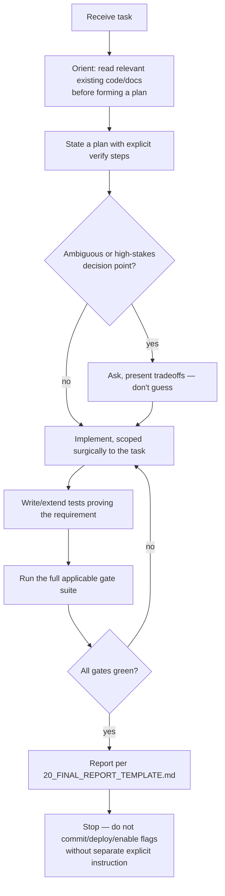

# 29 — AI Execution Guide

Related: [00_SYSTEM_PROMPT.md](00_SYSTEM_PROMPT.md), [17_BUG_WORKFLOW.md](17_BUG_WORKFLOW.md), [10_TEST_STRATEGY.md](10_TEST_STRATEGY.md).

This document is the practical "how to actually execute a task" companion to [00_SYSTEM_PROMPT.md](00_SYSTEM_PROMPT.md)'s operating contract. Where that document sets constraints, this one describes the workflow shape that has worked well in this project's history.

## 1. The general task shape

## 2. Orientation before action

For any nontrivial task, read before writing:

- The specific files you expect to change, in full — not just a grep match's surrounding lines.
- Any existing test file covering that area, to understand the established testing pattern before adding to it (see [22_CODING_STANDARDS.md](22_CODING_STANDARDS.md) §6).
- The relevant handbook sections ([03_ARCHITECTURE.md](03_ARCHITECTURE.md) through [09_DATA_FLOW.md](09_DATA_FLOW.md) for context; [11_TEST_MATRIX.md](11_TEST_MATRIX.md)/[18_REGRESSION.md](18_REGRESSION.md) for prior art on the same area).

Orientation is not billable "extra work" to be minimized — it is what prevents the most expensive class of mistake in this codebase: reintroducing a bug class that was already found and fixed once (see [18_REGRESSION.md](18_REGRESSION.md)) because the fix's context wasn't read first.

## 3. Working with the flag-gated migration pattern specifically

When a task touches a financial entity under active Supabase-primary migration:

1. Identify which flag(s) gate the entity ([08_FEATURES.md](08_FEATURES.md) §16).
2. Determine whether the task requires changing the Drift implementation, the Supabase implementation, the router, or all three — most bugs in this area are in exactly one of the three, and conflating them (e.g., "fixing" the router when the actual bug is in the Supabase repository) wastes effort and risks masking the real issue.
3. If a fix changes behavior in one implementation, check whether the equivalent behavior needs to change in the other (see [03_ARCHITECTURE.md](03_ARCHITECTURE.md) §4's emphasis on both paths giving equivalent results) — do not assume symmetry, verify it.
4. Test both flag states explicitly, not just the one the task happened to mention.

## 4. Live verification without a running app

This project's development environment has real, documented constraints: no GUI/Accessibility automation, no physical-device push-notification testing, and no separate staging Supabase project. The established, effective workaround pattern (used throughout this project's history) is:

1. Provision a dedicated QA identity (device via `register-device`, or a Supabase Auth QA user) directly via REST/SQL calls — no app required.
2. Exercise the exact backend surface under test via direct HTTP calls with clearly-QA-prefixed identifiers.
3. Verify results via direct SQL (Management API) — see [12_DATABASE_VALIDATION.md](12_DATABASE_VALIDATION.md).
4. Clean up QA rows explicitly, verify real-data row counts are unchanged.

This has reliably caught real bugs (see [18_REGRESSION.md](18_REGRESSION.md) `REG-001`, `REG-002`) that would not have been caught by unit tests alone, without needing device access. **Prefer this over guessing at backend behavior from reading code alone** when the task's correctness genuinely depends on live Postgres/PostgREST behavior (constraint inference, RLS enforcement, RPC atomicity).

## 5. When a scenario is genuinely device-only

Recognize the boundary honestly (see [10_TEST_STRATEGY.md](10_TEST_STRATEGY.md) §4): real push delivery, real notification-tap-while-backgrounded timing, real Shortcuts-automation behavior, and App Store/Play Store review-dependent behavior cannot be verified from this environment. When a task's completion criteria include one of these:

- Verify everything *around* it that is automatable (backend state, logs, the code paths leading up to and following the device-only step).
- Produce an exact, step-by-step manual procedure (see [13_NOTIFICATION_PIPELINE.md](13_NOTIFICATION_PIPELINE.md) §7 for the canonical format: exact action, exact expected notification/state/logs, PASS/FAIL criteria).
- Report it plainly as `MANUAL QA REQUIRED`, never as a false pass, and never by adding a debug bypass or requesting OS Accessibility permissions as a workaround (both explicitly disallowed — [00_SYSTEM_PROMPT.md](00_SYSTEM_PROMPT.md) §3 item 8).

## 6. Handling large, multi-phase tasks

Some tasks in this project's history have been genuinely large (a multi-phase backend migration, a full pipeline hardening pass, this handbook itself). For these:

- Track progress explicitly with a task list, updating status as work completes rather than batching updates at the end — this keeps the work auditable if a session is interrupted or resumed.
- Break the task into phases with a real gate between them (don't proceed to phase N+1 if phase N's gates are red — see [10_TEST_STRATEGY.md](10_TEST_STRATEGY.md) §3).
- If the user's instructions change scope mid-task (a genuine pivot, not a clarification), acknowledge the in-flight work honestly — state exactly what was completed and what remains paused, rather than either silently abandoning it or refusing to pivot. A short, honest status note costs little and preserves trust; see the actual precedent in this project's history where a notification-pipeline deployment task was paused mid-verification for a documentation-handbook request, and the paused state was reported explicitly rather than glossed over.

## 7. Reporting discipline

Every task of nontrivial size ends with the [20_FINAL_REPORT_TEMPLATE.md](20_FINAL_REPORT_TEMPLATE.md) structure — explicit gate results, explicit commit-safety/deploy-safety verdicts, explicit remaining manual steps. A report that reads well but doesn't state these explicitly is not a complete report, regardless of how much work was actually done correctly.

## 8. What good judgment looks like here, in practice

Drawing on this project's actual history:

- Recommending a getter-function fix over a captured-instance one when diagnosing a Riverpod staleness bug, because understanding *why* the staleness happened (not just patching the symptom) produced a durable fix (see [18_REGRESSION.md](18_REGRESSION.md) `REG-003`).
- Choosing code audit over forced live reproduction for the epoch-0 dedup-marker bug, because the mechanism was fully traceable from reading alone, and forcing a live failed-ack race deliberately would have been expensive and risky against a live project (see [18_REGRESSION.md](18_REGRESSION.md) `REG-005`).
- Refusing to fabricate a "PASS" for a device-only notification scenario when GUI automation was unavailable, and instead handing the exact procedure to the user to run themselves while independently verifying backend state (see [10_TEST_STRATEGY.md](10_TEST_STRATEGY.md) §4's origin).
- Stopping to explicitly re-confirm scope before a schema-altering migration, even when the same class of change had been approved once already earlier in the session, because approval scope does not automatically extend to a new, different destructive action ([00_SYSTEM_PROMPT.md](00_SYSTEM_PROMPT.md) §3 item 1/§8).

These are the behaviors this guide is trying to make repeatable, not exceptional.
