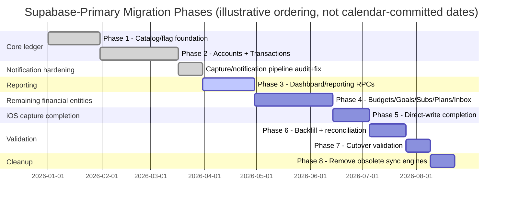

# 30 — Roadmap

Related: [03_ARCHITECTURE.md](03_ARCHITECTURE.md) §4, [08_FEATURES.md](08_FEATURES.md) §16, [19_RELEASE_GUIDE.md](19_RELEASE_GUIDE.md) §4.

This is a living document tracking where the architecture is headed, organized as the phased Supabase-primary migration plan plus adjacent workstreams. Update it whenever a phase's status changes — a stale roadmap actively misleads (see README.md "Maintenance").

## Phase overview

## Phase 1 — Catalog/flag foundation (complete)

Feature-flag infrastructure (`feature_flags`, `feature_flag_overrides`, `FeatureFlagService`), catalog sync (banks, parsers, categories, announcements), the routed-repository pattern established as the standard shape for any future financial-entity migration.

## Phase 2 — Accounts + Transactions Supabase-primary (complete)

`accounts_supabase_primary`, `transactions_supabase_primary` flags; `SupabaseAccountRepository`/`SupabaseTransactionRepository`; the rollback-cache-mirror mechanism (`financial_cache_health`); typed `RepoException` hierarchy; live QA methodology established (dedicated QA users, per-user overrides, direct SQL/REST verification). Bugs found and fixed during this phase: `REG-001` through `REG-004` (see [18_REGRESSION.md](18_REGRESSION.md)).

## Capture/notification pipeline hardening (complete)

A full read-only audit of the SMS capture and notification pipeline followed by a fix pass addressing 16 findings (`REG-005` through `REG-016`), a controlled deployment (migration `0033`, `process-ios-sms` redeploy) with live verification, and this handbook itself as the durable record of the resulting architecture and process. See [13_NOTIFICATION_PIPELINE.md](13_NOTIFICATION_PIPELINE.md), [14_SMS_CAPTURE_PIPELINE.md](14_SMS_CAPTURE_PIPELINE.md), [18_REGRESSION.md](18_REGRESSION.md).

## Phase 3 — Dashboard/reporting Supabase RPCs (in progress / next up)

**Goal**: move dashboard totals and report aggregations from on-device Drift SQL to server-side Postgres RPCs/views, behind a new `dashboard_supabase_summary` flag (default OFF), enabling correct multi-device-consistent reporting without repeatedly shipping the same aggregation logic to every client.

**Planned RPCs/views**: `monthly_financial_summary`, `account_balance_summary`, `category_spending_summary`, `budget_progress_summary`, `goal_progress_summary`.

**Business rules that must be preserved exactly** (see [01_GLOBAL_RULES.md](01_GLOBAL_RULES.md) Rule 5, [09_DATA_FLOW.md](09_DATA_FLOW.md) §1/§6):
- Supabase becomes authoritative for these aggregations under the flag — no partial cutover where reads mix sources.
- User's effective timezone applied consistently (see [11_TEST_MATRIX.md](11_TEST_MATRIX.md) `RPT-003`/`RPT-004`).
- Half-open date ranges, always.
- Income/expense/transfer/refund classification identical to the existing three independent implementations of transfer accounting ([09_DATA_FLOW.md](09_DATA_FLOW.md) §1) — the RPC becomes a **fourth** place this logic must be encoded identically, not a replacement for the existing three.
- Per-user access enforced (RLS or equivalent `WHERE user_id = auth.uid()` scoping within the function body if `SECURITY DEFINER` is used — prefer `SECURITY INVOKER` per the existing project convention unless there's a specific justified reason otherwise, see [05_BACKEND.md](05_BACKEND.md) §5).
- Indexed/efficient at the row volumes in [15_PERFORMANCE.md](15_PERFORMANCE.md)/[16_STRESS_TESTING.md](16_STRESS_TESTING.md) `STRESS-DATA-*`.

**Validation scenarios required before this phase is considered complete**: empty month, income-only month, expense-only month, mixed month, transfers-present, refunds-present, multi-currency, month boundary (`RPT-002`), Riyadh timezone boundary (`RPT-003`), Cairo timezone boundary (`RPT-004`), 1000+ transaction performance (`RPT-008`, `STRESS-DATA-001`).

## Phase 4 — Remaining financial entities to Supabase-primary

**Order matters** (each entity's server tables/RPCs should be built and validated before the next, since later entities may reference earlier ones): budgets → goals (+ `user_goal_contributions`) → subscriptions/bills (+ `user_bill_payments`) → plans (+ `user_plan_transaction_links`) → smart inbox.

**New tables required**: `user_goal_contributions`, `user_bill_payments`, `user_plan_transaction_links` — each following the standard `user_*` column conventions in [04_DATABASE.md](04_DATABASE.md) §3.2.

**New flags** (all OFF by default): `budgets_supabase_primary`, `goals_supabase_primary`, `subscriptions_supabase_primary`, `plans_supabase_primary`, `smart_inbox_supabase_primary` — these already exist as flag keys (see [08_FEATURES.md](08_FEATURES.md) §16) but are not yet backed by a Supabase-primary implementation for their respective entities; this phase is what actually wires each one up.

Each entity requires: backfill (deterministic keys per [14_SMS_CAPTURE_PIPELINE.md](14_SMS_CAPTURE_PIPELINE.md) §8's pattern) with reconciliation, provider invalidation wiring (extending `AppShell._handleSupabasePrimaryFlagTransition()`), typed error handling, and must not depend on any old sync-engine code being active.

## Phase 5 — iOS capture direct-write completion

Full validation of the `capture_direct_supabase_write` path end-to-end: backend parser remains primary, Swift `PreviewParser` remains fallback-only (never remove — [00_SYSTEM_PROMPT.md](00_SYSTEM_PROMPT.md) §3 item 6), `processed_captures` remains the safety-net relay (never remove until every capture-path criterion below passes for an extended, monitored period), dedup via `source_payload_id` fully verified, APNs-before-app-open behavior confirmed, no duplicate on reopen. Global capture flag stays OFF throughout; validated only via QA-user overrides.

## Phase 6 — Full backfill + reconciliation report

For every financial entity migrated in Phases 2–5: a complete reconciliation report comparing local Drift counts against Supabase active/tombstoned counts, with explicit created/matched/mismatched/failed/unresolved-parent/skipped-duplicate/retried counts per [14_SMS_CAPTURE_PIPELINE.md](14_SMS_CAPTURE_PIPELINE.md) §8. Local Drift data is never deleted as part of this phase — it remains the rollback path.

## Phase 7 — Financial cutover validation

Confirms, per user cohort being cut over: Supabase is genuinely authoritative for both reads and writes (no silent Drift fallback), and that old sync engines (see Phase 8's removal list) are confirmed **uninvoked** in logs/telemetry for that cohort — not merely "believed unused." This is a verification-only phase; it does not itself delete anything.

## Phase 8 — Cleanup of proven-obsolete sync engine code

Only after Phase 7 confirms zero invocation over a sufficient observation window: remove `LedgerOutboxQueue`, `LedgerPushService`, `LedgerSyncService`, `LedgerSyncEngine`, `PlanningOutboxQueue`, `PlanningPushService`, `PlanningPullService`, `PlanningSyncEngine`, `SmartInboxSyncService`, and any now-orphaned providers/flags/guest-state code specifically related to the pre-Supabase-primary sync mechanism.

**Explicitly out of scope for this phase, requiring separate approval if ever considered**: removing `processed_captures`, the Swift `PreviewParser`, or changing Android SMS permission handling — none of these are "old sync engine" code; they are active, load-bearing parts of the current (and likely permanent) architecture (see [00_SYSTEM_PROMPT.md](00_SYSTEM_PROMPT.md) §3).

## Adjacent, not-yet-scheduled workstreams

- **Monitoring gaps** identified in [24_MONITORING.md](24_MONITORING.md) §4 (per-flag-cohort error-rate visibility) — recommended to close before Phase 3's flag reaches any meaningful global rollout percentage.
- **Backup verification practice** ([26_BACKUP_STRATEGY.md](26_BACKUP_STRATEGY.md) §5) — establishing a real, scheduled restore-test practice rather than an ad-hoc one.
- **Multi-device conflict handling** beyond the current targeted-column-update approach ([15_PERFORMANCE.md](15_PERFORMANCE.md) §5, [11_TEST_MATRIX.md](11_TEST_MATRIX.md) `CONF-*`) — revisit only if measured real-world conflicts warrant it, not preemptively.
- **FX conversion** — explicitly a non-goal today ([02_PROJECT_DISCOVERY.md](02_PROJECT_DISCOVERY.md) §6); would be a deliberate, separately-scoped product decision if ever pursued, not an incremental architecture change.

## How to use this roadmap

Before starting work on any phase above, re-verify its prerequisites are actually still true against the current codebase (this document, like any other, can drift from reality — see [17_BUG_WORKFLOW.md](17_BUG_WORKFLOW.md)'s general "verify before recommending from memory" discipline, which applies equally to this handbook's own claims). Update the phase's status and this file's content in the same change that advances it.
